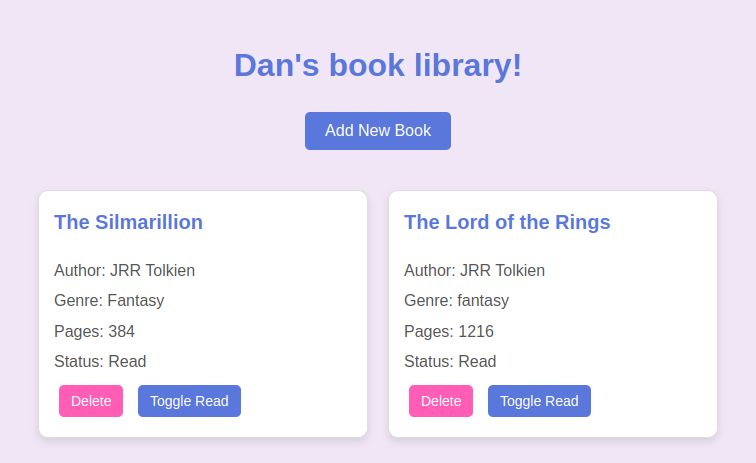

# Book Library Website

A simple and interactive book library web application where you can add, delete, and track the reading status of your books. Built with HTML, CSS, and JavaScript.

 

## Features

- **Add Books**: Add new books to your library by filling out a form with the book's title, author, genre, page count, and reading status.
- **Delete Books**: Remove books from your library with the click of a button.
- **Toggle Reading Status**: Mark books as "Read" or "Unread" with a toggle button.
- **Responsive Design**: The website is designed to work seamlessly on both desktop and mobile devices.
- **Retro Lofi Vibe**: Aesthetic design with a retro color palette for a calming and visually appealing experience.

## Technologies Used

- **HTML**: Structure of the website.
- **CSS**: Styling and layout, including a retro lofi color palette.
- **JavaScript**: Dynamic functionality for adding, deleting, and toggling books.

## How to Use

1. **Add a Book**:
   - Click the "Add New Book" button to open the form.
   - Fill in the book's details (title, author, genre, pages, and reading status).
   - Click "Add Book" to save it to your library.

2. **Delete a Book**:
   - Click the "Delete" button on the book card you want to remove.
   - The book will be removed from both the library display and the internal array.

3. **Toggle Reading Status**:
   - Click the "Toggle Read" button on any book card to switch its status between "Read" and "Unread."

## Setup Instructions

To run this project locally, follow these steps:

1. **Clone the Repository**:
   ```bash
   git clone https://github.com/your-danoverkill/book-library.git
   cd book-library


##  Future Improvements
1. **Local Storage**: 
    - Save the library data in the browser's local storage so it persists after refreshing the page.

2. **Search and Filter:**: 
    - Add functionality to search for books or filter them by genre, author, or reading status.
